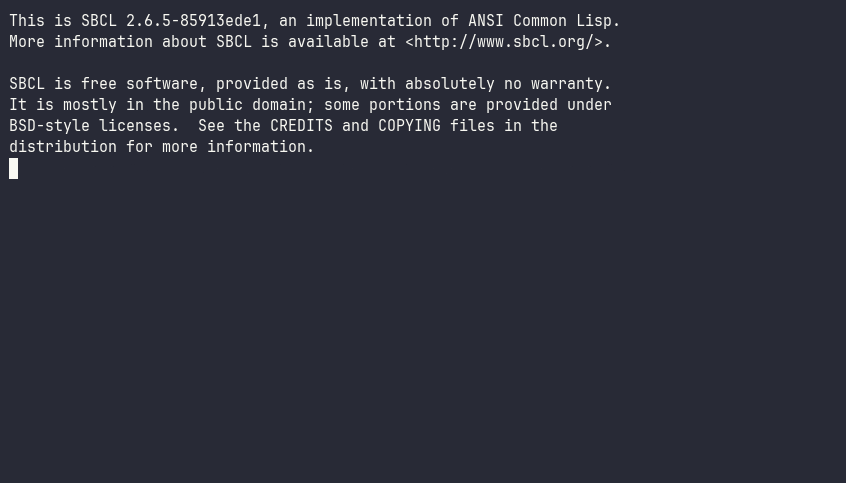

# revision-hexdump — an editable hex editor for [revision](https://github.com/lispnik/revision)

An **editable hex editor window** for the [`revision`](https://github.com/lispnik/revision)
text-mode UI framework. It renders a file as the classic three-column hexdump —
**offset · hex bytes · ASCII gutter** — and lets you edit it *in place*: move the
cursor, type hex digits or ASCII, and save. It doubles as a worked example of
authoring a custom **scrollable, editable widget** on revision's public API.



```lisp
(asdf:load-system "revision-hexdump")
(revision-hexdump:run-hexdump "/bin/ls")   ; open a file full-screen
(revision-hexdump:run-hexdump)             ; an empty buffer
```

## Editing

The cursor sits on one byte, shown highlighted in **both** the hex and ASCII panes.
Editing **overwrites** the byte under the cursor, so the file keeps its size (the
classic hex-editor default).

| Key | Action |
|-----|--------|
| `←` `→` `↑` `↓` | move one byte / one row (16 bytes) |
| `PgUp` `PgDn` | page up / down |
| `Home` `End` | start / end of file |
| `Tab` | switch the **hex ⇄ ASCII** edit pane |
| `Insert` | toggle **overwrite ⇄ insert** mode |
| `Shift`+move | extend the byte **selection** |
| `Ctrl+C` `Ctrl+X` `Ctrl+V` | copy / cut / paste the selection |
| `Ctrl+K` | toggle a **bookmark** at the cursor |
| `Ctrl+N` `Ctrl+P` | jump to the next / previous bookmark |
| `Ctrl+D` | apply a **structural template** at the cursor |
| `Ctrl+Q` | list the template's fields (jump to one) |
| `Ctrl+T` | show / hide the data inspector |
| `Ctrl+B` | toggle the offset base (hex / decimal) |
| `Ctrl+U` | toggle control-character glyphs (`␀␁…` vs `.`) |
| `Ctrl+L` | toggle a read-only lock |
| `0`–`9` `a`–`f` | edit the byte's high then low nibble (hex pane) |
| *(printable)* | edit the byte (ASCII pane) |
| `Bksp` `Del` | delete a byte (insert mode) |
| `Ctrl+F` | find — hex bytes (`deadbeef`) or `/text`; empty repeats (find-next) |
| `Ctrl+R` | replace all — find + replacement (hex or `/text`; empty replacement deletes) |
| `Ctrl+G` | go to a hex offset (`1F` or `0x1F`) |
| `Ctrl+E` | toggle the data inspector's byte order (LE / BE) |
| `Ctrl+Z` `Ctrl+Y` | undo / redo |
| `Ctrl+S` | save (prompts for a name when the buffer is new) |
| `Ctrl+W` | save as… (choose a new file) |
| mouse click | move the cursor to a byte / pick a pane |
| wheel | scroll |

In the **hex** pane a byte takes two keystrokes (high nibble, then low), after which
the cursor advances. In the **ASCII** pane one printable key edits the byte.
Edited-but-unsaved bytes are flagged, and the title / frame show a `*` until you save.

**Overwrite** mode (the default) keeps the file's size — editing replaces the byte under
the cursor. **Insert** mode (toggle with `Insert`) lets typing *insert* new bytes and
`Bksp`/`Del` *remove* them, so you can change the file's length or fill an empty file.
Undo/redo (`Ctrl+Z`/`Ctrl+Y`) covers overwrite, insert, and delete alike, and the frame
indicator shows the pane and mode (`hex ins 0x1F/0x2C *`).

**Structural templates** turn the raw dump into a typed view. A template describes a binary
layout as `(name type . options)` fields — `(:endian …)`, scalars (`:u8`…`:i64`,
`:f32`/`:f64`), `(:string N)`, `(:bytes N)`, `(:array elem N)`, and nested `(:struct …)`.
Lengths can be **dynamic** — a `N` may *name a prior field* (`(name (:string name-len))`,
`(:array :u16 tag-count)`) — and scalars can carry `:enum ((val . name)…)` or
`:flags ((bit . name)…)` options that annotate the value (`kind = 1 [file]`,
`flags = 3 [active|hidden]`). `Ctrl+D` applies a template (BMP / WAV / GIF headers and a
length-prefixed record are built in) at the cursor: the field under the cursor is highlighted
and named in the status line, and `Ctrl+Q` lists every parsed field to jump between them.
(An edit that shifts offsets clears the overlay.)

**Shift**+movement extends a byte **selection** (highlighted); `Ctrl+C`/`Ctrl+X`/`Ctrl+V`
copy / cut / paste it through a shared byte clipboard (paste inserts in insert mode,
overwrites in overwrite mode). `Ctrl+R` **replaces** all occurrences of a pattern (an empty
replacement deletes them). Multi-byte operations — paste, cut, replace-all — are a single
undo step.

A column **ruler** heads the dump, and a toggleable **data inspector** (`Ctrl+T`) at its
foot decodes the bytes at the cursor as `u8`/`i8` … `u64`/`i64`, `f32`/`f64`, plus the
**character** and **binary** of the byte — in little- or big-endian (`Ctrl+E`). The dump
**adapts its width** to the window (8/16/24/32 bytes per row), shows non-printable bytes as
Unicode **control pictures** (`Ctrl+U` for plain dots), and the offset column switches
between **hex and decimal** (`Ctrl+B`). **Bookmarks** (`Ctrl+K`, jump with `Ctrl+N`/`Ctrl+P`)
mark offsets, and `Ctrl+L` locks a buffer read-only.

**New files & Save-As.** Opening with no path (`run-hexdump`) gives an empty buffer in
insert mode; type, then `Ctrl+S` prompts for a name (via the framework's `:save` file
dialog, which confirms overwrites). `Ctrl+W` is Save-As for an existing buffer.

**Large files.** A file over `*max-in-memory*` (default 64 MB) is **not loaded into RAM** —
it is read one page at a time on demand through a bounded cache, so a multi-GB file can be
viewed, navigated, searched, and inspected without OOM. It is also **fully editable** — a
**piece table** layers edits over the paged source and an append-only add-buffer, so
overwrite, **insert, and delete all work** (the file's *size* can change) without loading
it. On save the document is **streamed** out piece by piece (temp file + rename), again
holding no full copy in memory. Small files load fully; behaviour is identical either way.

## As a desktop window

Loading the system registers a `:hexdump` window builder and a **Tools ▸ Hex editor…**
menu item, so on a `revision` desktop it just works:

```lisp
(revision-hexdump:open-hexdump desktop "/bin/ls")   ; open on a running desktop
```

The window persists across sessions (it remembers the open file via the framework's
layout save/restore), refuses to be discarded on `Esc` while it holds unsaved edits,
and prompts to save when closed dirty. A host that curates its own menu can suppress
the auto-added item with `(setf revision-hexdump:*auto-menu* nil)`.

## How it's built

A single `hex-view` subclass of `revision:view` does the work, using only the
framework's **public widget-authoring surface**:

- **`draw-text` / `fill-row`** to paint the three aligned columns (all column
  positions derive from one `+bpr+` = 16 constant, so the panes stay aligned);
- the **scroll protocol** (`scroll-pos` / `scroll-max` / `scroll-page` / `scroll-to`)
  so the hosting window draws a frame scrollbar bound to the view, plus
  **`frame-indicator`** for the `hex 0x1F/0x2A *` readout on the bottom frame;
- **`handle-event`** on `key-event` / `mouse-down` / `wheel-event` for movement and
  editing, and **`view-key-hints`** so the widget's keys appear in the generated
  keybinding reference;
- the reactive metaclass, so moving the cursor or editing a byte repaints
  automatically — the widget never calls `draw` on itself.

The buffer is a fill-pointered `(unsigned-byte 8)` vector; load/edit/save are plain
functions over the view, so the whole suite runs **headless** (no terminal).

## Build & test

Assumes the sibling framework checkout `../revision` exists (siblings under one
parent directory). No external runtime dependencies; the test suite uses **FiveAM**
(which `revision` pins in its `systems.csv`).

```sh
make build                 # compile + load (a build check)
make test                  # the FiveAM suite (headless)
make run FILE=/bin/ls      # open a file full-screen
```

## License

MIT.
